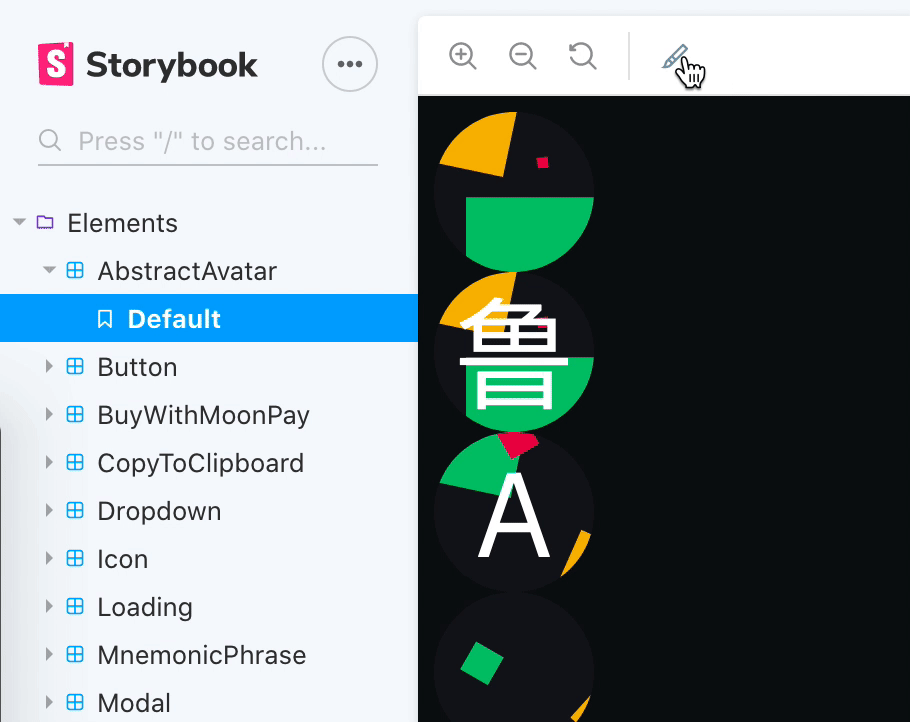
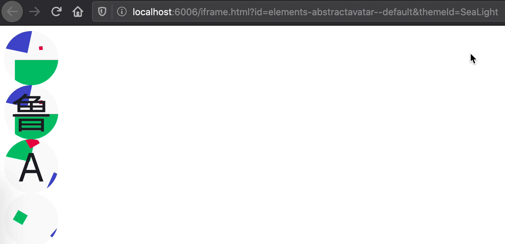

<p align="center"></p>

This is a Storybook addon that allows you to switch between multiple themes via the Storybook UI or
a query parameter in the URL.

## Quick start

```bash
yarn add --dev storybook-styled-components-theme-selector
```

```js
// .storybook/main.js
module.exports = {
  stories: ['../**/*.stories.tsx'],
  addons: [
    '…',
    'storybook-styled-components-theme-selector', // ⬅️
  ],
};
```

```js
// .storybook/preview.js
import React from 'react';
import { addDecorator } from '@storybook/react';
import { withThemesProvider } from 'storybook-styled-components-theme-selector';

import { Theme1 } from '../Theme1';
import { Theme2 } from '../Theme2';
import { SomeGlobalStyles } from '../somewhere';

const themes = [
  {
    ...Theme1,
    id: 'Theme1', // ⚠️ Your themes are expected to contain this property
    name: 'Theme 1 (Light)', // Optionally display a nicer in the Storybook UI
  },
  {
    ...Theme2,
    id: 'Theme2',
    name: 'Theme 2 (Dark)',
  },
];

addDecorator(
  withThemesProvider({
    children: <SomeGlobalStyles />, // Optional
    themes,
  }),
);
```

## Set the theme using the URL

<p align="center"></p>

You may attach a `themeId` query parameter to the Storybook URL to set the theme for your story.

This could be particularly useful for automated testing (e.g. CSS regression testing with
screenshots) if you use Storybook's iframe URL. For example:

```
http://localhost:6006/iframe.html?id=elements-mycomponent--default&themeId=Theme1
```

```
http://localhost:6006/iframe.html?id=elements-mycomponent--default&themeId=Theme2
```
